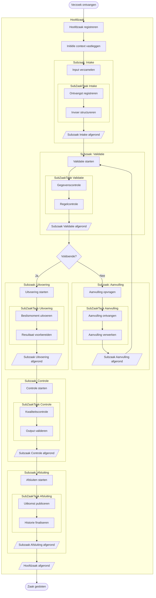
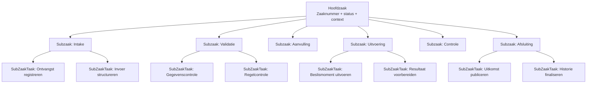
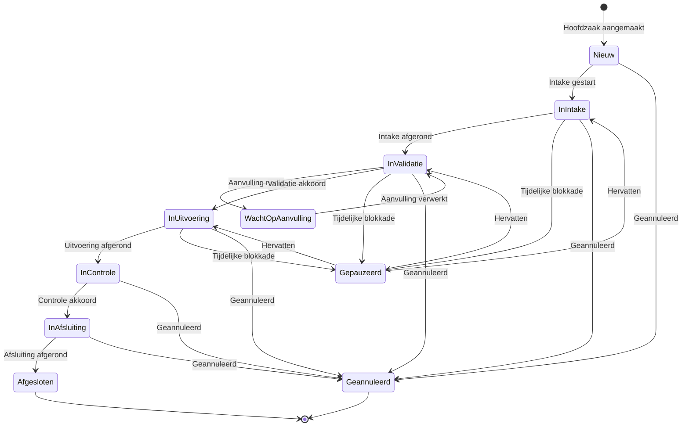
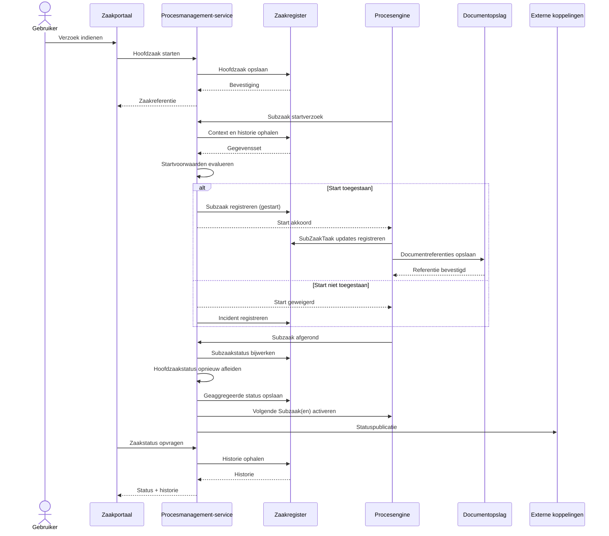
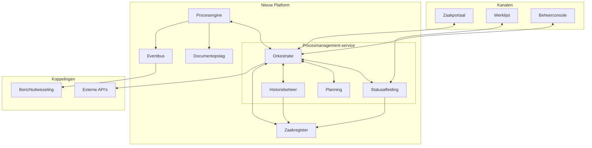
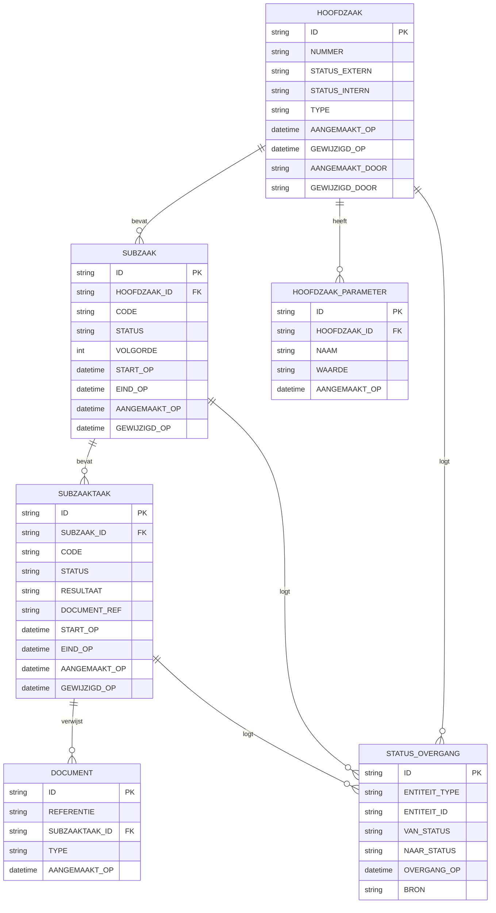

# Generiek Procesmodel RVO – Zaakmanagement op nieuw platform

> Dit document beschrijft een generiek, regeling-onafhankelijk procesmodel voor zaakmanagement.
> Alle diagrammen zijn in Mermaid en gebruiken gestandaardiseerde termen.

---

## Inhoudsopgave

1. [Doel en afbakening](#1-doel-en-afbakening)
2. [Kernprincipes](#2-kernprincipes)
3. [Generieke end-to-end lifecycle](#3-generieke-end-to-end-lifecycle)
4. [Hiërarchie: Hoofdzaak · Subzaak · SubZaakTaak](#4-hiërarchie-hoofdzaak--subzaak--subzaaktaak)
5. [Statusmodel](#5-statusmodel)
6. [Fase-orkestratie (sequentie)](#6-fase-orkestratie-sequentie)
7. [Architectuur (componenten)](#7-architectuur-componenten)
8. [Generiek datamodel](#8-generiek-datamodel)
9. [Governance en ontwerpafspraken](#9-governance-en-ontwerpafspraken)
10. [Uitbreidbaarheid voor nieuwe regelingen](#10-uitbreidbaarheid-voor-nieuwe-regelingen)
11. [Lead-architect validatie](#11-lead-architect-validatie)
12. [Naamgevingsconventies](#12-naamgevingsconventies)

---

## 1. Doel en afbakening

Dit model is bedoeld als herbruikbaar fundament voor het opzetten van nieuwe uitvoeringsprocessen op een nieuw RVO-platform.

**Afbakening:**
- Geen regeling-specifieke processtappen.
- Geen juridisch-specifieke stromen of terminologie.
- Geen productspecifieke of domeinspecifieke uitzonderingen.

**Doel:**
- Eén uniforme structuur voor processturing, statusafleiding en historie.
- Snelle onboarding van nieuwe regelingen via configuratie in plaats van maatwerk.

---

## 2. Kernprincipes

1. **Configuratie boven codering**  
   Procesvarianten worden geconfigureerd met fase- en taakdefinities.

2. **Eenduidige hiërarchie**  
   Elke Hoofdzaak bestaat uit Subzaken; elke Subzaak bestaat uit SubZaakTaak-items.

3. **Centrale orkestratie**  
   Een Procesmanagement-service bepaalt startvoorwaarden, volgorde en statusafleiding.

4. **Volledige auditability**  
   Elke statuswijziging en taakuitkomst is historisch herleidbaar.

5. **Idempotente verwerking**  
   Herhaalde events veroorzaken geen dubbele of inconsistente mutaties.

6. **Scheiding van verantwoordelijkheden**  
   UI, processturing, gegevensopslag en documentopslag zijn losgekoppeld.

---

## 3. Generieke end-to-end lifecycle

Onderstaand proces toont een neutrale lifecycle zonder regeling- of juridisch-specifieke paden.

---

## 4. Hiërarchie: Hoofdzaak · Subzaak · SubZaakTaak

### Legenda

| Niveau | Term | Omschrijving |
|--------|------|--------------|
| 1 | **Hoofdzaak** | Centrale casus met unieke identificatie en gecombineerde status |
| 2 | **Subzaak** | Afgebakende fase met eigen lifecycle |
| 3 | **SubZaakTaak** | Kleinste uitvoerbare taak binnen een Subzaak |

---

## 5. Statusmodel

Het statusmodel ondersteunt een externe, vereenvoudigde status en een interne, gedetailleerde status. Parallelle Subzaken zijn toegestaan; de Hoofdzaakstatus is een afgeleide aggregatie.

---

## 6. Fase-orkestratie (sequentie)

---

## 7. Architectuur (componenten)

---

## 8. Generiek datamodel

Dit model bevat alleen generieke kernentiteiten die in vrijwel elk zaakproces toepasbaar zijn.

### Datamodel-richtlijnen

- Alle entiteiten hebben technische ID, tijdstempels en herkomstvelden.
- Statussen worden centraal beheerd en historisch gelogd.
- Extensies worden toegevoegd via parameters of aanvullende tabellen, niet door kernentiteiten te vervuilen.

---

## 9. Governance en ontwerpafspraken

### 9.1 Procesgovernance
- Elke Subzaak heeft een duidelijke entry- en exit-conditie.
- Elke SubZaakTaak levert een expliciet resultaat op.
- Herstart en compensatie verlopen via gecontroleerde statusovergangen.

### 9.2 Technische governance
- API-contracten versioneren per major/minor.
- Event schema’s worden centraal gevalideerd.
- Idempotency keys zijn verplicht op muterende opdrachten.

### 9.3 Operationele governance
- Monitoring op doorlooptijd, foutpercentages en wachtrijen.
- Incidentregistratie op taak-, fase- en hoofdzakniveau.
- Beheerconsole ondersteunt pauzeren, hervatten en handmatige correctie.

### 9.4 Security en privacy
- Least privilege voor service-accounts.
- Gegevensminimalisatie in externe publicaties.
- Volledige audittrail voor alle statusmutaties.

---

## 10. Uitbreidbaarheid voor nieuwe regelingen

Nieuwe regelingen worden toegevoegd met een vaste implementatiestrategie:

1. Definieer een nieuw **zaaktype** met configuratie.
2. Selecteer en orden standaard **Subzaken**.
3. Koppel per Subzaak de benodigde **SubZaakTaak-items**.
4. Configureer statusmapping extern/intern.
5. Koppel optionele externe integraties via gestandaardiseerde connectoren.

**Resultaat:**
- Hoge herbruikbaarheid van platformcomponenten.
- Beperkt maatwerk en voorspelbare implementatietijd.
- Eenduidige operatie over verschillende regelingen heen.

---

## 11. Lead-architect validatie

Deze validatie beoordeelt of het model geschikt is als blauwdruk voor een nieuwe regeling op een nieuw platform.

### 11.1 Validatiecriteria

- **Generiek:** geen regeling- of juridische afhankelijkheden.
- **Schaalbaar:** meerdere zaaktypen en parallelle subzaken ondersteund.
- **Bestuurbaar:** beheer, monitoring en herstelpaden expliciet.
- **Controleerbaar:** auditbare statusovergangen en historie.
- **Implementeerbaar:** duidelijke componentgrenzen en datacontracten.

### 11.2 Beoordeling

| Criterium | Resultaat | Toelichting |
|----------|-----------|-------------|
| Generiek | ✅ | Regeling-specifieke en juridische termen verwijderd |
| Schaalbaar | ✅ | Parallelle subzaken en configureerbare stappen ondersteund |
| Bestuurbaar | ✅ | Pauzeren/hervatten, incidentregistratie en beheerconsole opgenomen |
| Controleerbaar | ✅ | Statusovergangen en historie als kernmodel gedefinieerd |
| Implementeerbaar | ✅ | Duidelijke scheiding tussen portaal, orkestratie, engine en storage |

### 11.3 Iteratiecheck

De validatie toont geen blokkerende hiaten voor generieke inzet. Een extra iteratie is niet noodzakelijk voor de basisarchitectuur.

**Conclusie:** model is optimaal als generieke startarchitectuur voor nieuwe regelingen op een nieuw RVO-platform.

---

## 12. Naamgevingsconventies

| Begrip | Definitie |
|--------|-----------|
| **Hoofdzaak** | Centrale casus met unieke identificatie en geaggregeerde status |
| **Subzaak** | Fase binnen de Hoofdzaak met eigen lifecycle |
| **SubZaakTaak** | Kleinste uitvoerbare taak binnen een Subzaak |
| **Procesmanagement-service** | Component voor orkestratie, statusafleiding en historie |
| **Procesengine** | Component die SubZaakTaak-items uitvoert conform configuratie |
| **Zaakregister** | Persistente opslag voor Hoofdzaak, Subzaak, SubZaakTaak en historie |
| **Documentopslag** | Opslag van documentreferenties gekoppeld aan SubZaakTaak-items |
| **Externe status** | Vereenvoudigde status voor externe consumptie |
| **Interne status** | Gedetailleerde status voor operationele sturing |
