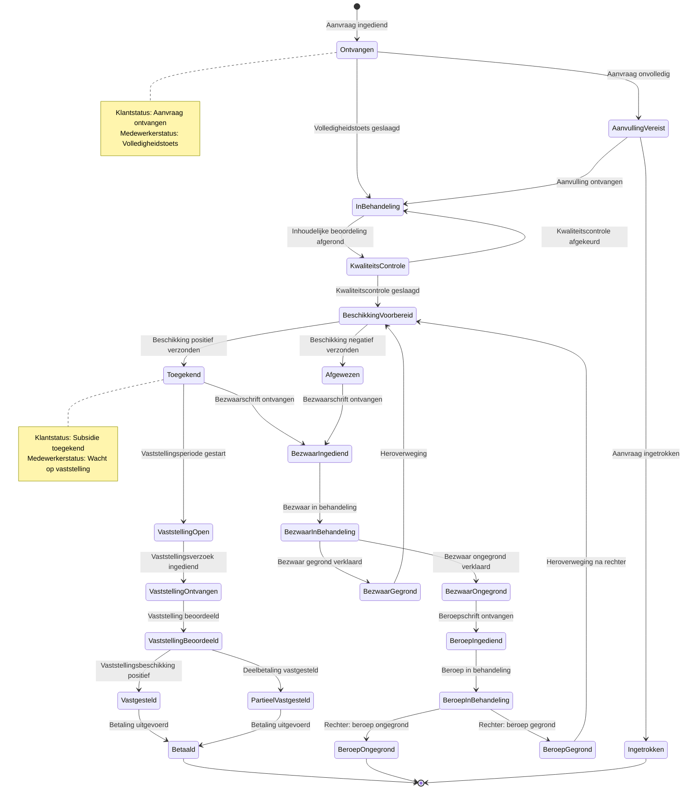
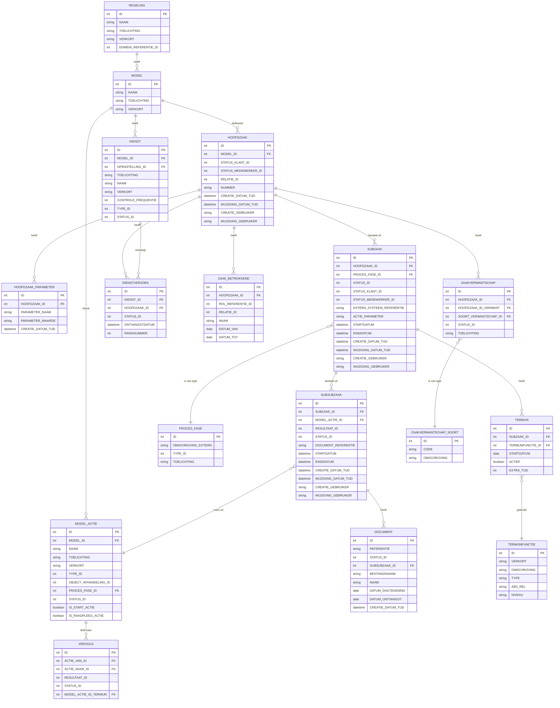

# Procesmodel RVO – UPNL Zaakmanagement

> Gebaseerd op de RVO-documentatie: *Procesmanagement* en *Zaakmanagement* (datamodel).
> Alle diagrammen zijn gemaakt met Mermaid. Naamgeving volgt de UPNL/RVO-terminologie consistent.

---

## Inhoudsopgave

1. [Overzicht: RVO Zaakproces (end-to-end)](#1-overzicht-rvo-zaakproces-end-to-end)
2. [Hoofdzaak · Subzaak · Subsubzaak – hiërarchie](#2-hoofdzaak--subzaak--subsubzaak-hiërarchie)
3. [Zaakstatus – toestandsdiagram](#3-zaakstatus--toestandsdiagram)
4. [Fasebeheer – sequentiediagram](#4-fasebeheer--sequentiediagram)
5. [Architectuur – componentdiagram](#5-architectuur--componentdiagram)
6. [Databasismodel – entiteiten](#6-databasismodel--entiteiten)

---

## 1. Overzicht: RVO Zaakproces (end-to-end)

Het volgende diagram toont de volledige levenscyclus van een RVO-zaak, van aanvraag tot en met eventuele bezwaar-/beroepsprocedure. Elke **Hoofdzaak** doorloopt één of meerdere **Subzaken** (fases). Iedere Subzaak bestaat uit één of meerdere **Subsubzaken** (taken).

```mermaid
flowchart TD
    START([Aanvraag ingediend]) --> HZ_AANMAKEN

    subgraph HZ["Hoofdzaak"]
        HZ_AANMAKEN[Hoofdzaak aanmaken\nin ORM] --> HZ_REG[Zaaknummer toekennen]
        HZ_REG --> SZ_AANVRAAG

        subgraph SZ1["Subzaak: Aanvraag"]
            SZ_AANVRAAG[Aanvraag ontvangen] --> TAAK_VOLLEDIGHEID
            subgraph SSZ1["Subsubzaak: Taken Aanvraag"]
                TAAK_VOLLEDIGHEID[Volledigheidstoets] --> TAAK_ONTVANGST[Ontvangstbevestiging sturen]
            end
            TAAK_ONTVANGST --> SZ1_AFGEROND[/Subzaak Aanvraag\nafgerond/]
        end

        SZ1_AFGEROND --> SZ_BEHANDELING

        subgraph SZ2["Subzaak: Behandeling"]
            SZ_BEHANDELING[Beoordeling starten] --> TAAK_INHOUDELIJK
            subgraph SSZ2["Subsubzaak: Taken Behandeling"]
                TAAK_INHOUDELIJK[Inhoudelijke beoordeling] --> TAAK_KWC[Kwaliteitscontrole]
                TAAK_KWC --> TAAK_CONCEPT[Conceptbeschikking opstellen]
            end
            TAAK_CONCEPT --> SZ2_AFGEROND[/Subzaak Behandeling\nafgerond/]
        end

        SZ2_AFGEROND --> SZ_BESCHIKKING

        subgraph SZ3["Subzaak: Beschikking"]
            SZ_BESCHIKKING[Beschikking voorbereiden] --> TAAK_BESCHIKKING
            subgraph SSZ3["Subsubzaak: Taken Beschikking"]
                TAAK_BESCHIKKING[Beschikking opstellen] --> TAAK_VERZENDEN[Beschikking verzenden]
            end
            TAAK_VERZENDEN --> SZ3_AFGEROND[/Subzaak Beschikking\nafgerond/]
        end

        SZ3_AFGEROND --> BESLISSING{Klant akkoord?}

        BESLISSING -- Ja --> SZ_VASTSTELLING
        BESLISSING -- Nee --> SZ_BEZWAAR

        subgraph SZ4["Subzaak: Bezwaar"]
            SZ_BEZWAAR[Bezwaarschrift ontvangen] --> TAAK_BEZWAAR
            subgraph SSZ4["Subsubzaak: Taken Bezwaar"]
                TAAK_BEZWAAR[Bezwaar beoordelen] --> TAAK_HOORZITTING[Hoorzitting organiseren]
                TAAK_HOORZITTING --> TAAK_BEZWAAR_BESLISSING[Beslissing op bezwaar]
            end
            TAAK_BEZWAAR_BESLISSING --> SZ4_AFGEROND[/Subzaak Bezwaar\nafgerond/]
        end

        SZ4_AFGEROND --> BESLISSING_BEZWAAR{Bezwaar\ngegrond?}
        BESLISSING_BEZWAAR -- Nee --> SZ_BEROEP
        BESLISSING_BEZWAAR -- Ja --> SZ_VASTSTELLING

        subgraph SZ5["Subzaak: Beroep"]
            SZ_BEROEP[Beroepschrift ontvangen] --> TAAK_BEROEP
            subgraph SSZ5["Subsubzaak: Taken Beroep"]
                TAAK_BEROEP[Beroep begeleiden] --> TAAK_UITSPRAAK[Rechterlijke uitspraak verwerken]
            end
            TAAK_UITSPRAAK --> SZ5_AFGEROND[/Subzaak Beroep\nafgerond/]
        end

        SZ5_AFGEROND --> SZ_VASTSTELLING

        subgraph SZ6["Subzaak: Vaststelling"]
            SZ_VASTSTELLING[Vaststellingsverzoek ontvangen] --> TAAK_VASTSTELLING
            subgraph SSZ6["Subsubzaak: Taken Vaststelling"]
                TAAK_VASTSTELLING[Vaststelling beoordelen] --> TAAK_VASTST_BESCHIKKING[Vaststellingsbeschikking opstellen]
            end
            TAAK_VASTST_BESCHIKKING --> SZ6_AFGEROND[/Subzaak Vaststelling\nafgerond/]
        end

        SZ6_AFGEROND --> SZ_BETALING

        subgraph SZ7["Subzaak: Betaling"]
            SZ_BETALING[Betaling initiëren] --> TAAK_BETALING
            subgraph SSZ7["Subsubzaak: Taken Betaling"]
                TAAK_BETALING[Betaalopdracht aanmaken] --> TAAK_BETALING_CONTROLE[Betaling controleren]
            end
            TAAK_BETALING_CONTROLE --> SZ7_AFGEROND[/Subzaak Betaling\nafgerond/]
        end

        SZ7_AFGEROND --> HZ_AFGEROND[/Hoofdzaak afgerond/]
    end

    HZ_AFGEROND --> EINDE([Zaak gesloten])
```

---

## 2. Hoofdzaak · Subzaak · Subsubzaak – hiërarchie

De UPNL-procesmanagementservice hanteert een drielaags hiërarchie. Dit diagram toont de structurele relaties en de bijbehorende terminologie.

```mermaid
graph TD
    HZ["🗂️ Hoofdzaak\n(= Zaak)\nZaaknummer, Klantstatus,\nMedewerkerstatus"]

    HZ --> SZ_AAN["📁 Subzaak: Aanvraag\n(= Fase)"]
    HZ --> SZ_BEH["📁 Subzaak: Behandeling\n(= Fase)"]
    HZ --> SZ_BES["📁 Subzaak: Beschikking\n(= Fase)"]
    HZ --> SZ_VAR["📁 Subzaak: Vaststelling\n(= Fase)"]
    HZ --> SZ_BEZ["📁 Subzaak: Bezwaar\n(= Fase, optioneel)"]
    HZ --> SZ_BER["📁 Subzaak: Beroep\n(= Fase, optioneel)"]
    HZ --> SZ_BET["📁 Subzaak: Betaling\n(= Fase)"]

    SZ_AAN --> SSZ_1["📄 Subsubzaak: Volledigheidstoets\n(= Taak)"]
    SZ_AAN --> SSZ_2["📄 Subsubzaak: Ontvangstbevestiging\n(= Taak)"]

    SZ_BEH --> SSZ_3["📄 Subsubzaak: Inhoudelijke beoordeling\n(= Taak)"]
    SZ_BEH --> SSZ_4["📄 Subsubzaak: Kwaliteitscontrole\n(= Taak)"]

    SZ_BES --> SSZ_5["📄 Subsubzaak: Beschikking opstellen\n(= Taak)"]
    SZ_BES --> SSZ_6["📄 Subsubzaak: Beschikking verzenden\n(= Taak)"]

    SZ_VAR --> SSZ_7["📄 Subsubzaak: Vaststelling beoordelen\n(= Taak)"]
    SZ_VAR --> SSZ_8["📄 Subsubzaak: Vaststellingsbeschikking\n(= Taak)"]

    SZ_BEZ --> SSZ_9["📄 Subsubzaak: Bezwaar beoordelen\n(= Taak)"]
    SZ_BEZ --> SSZ_10["📄 Subsubzaak: Hoorzitting\n(= Taak)"]

    SZ_BET --> SSZ_11["📄 Subsubzaak: Betaalopdracht\n(= Taak)"]
    SZ_BET --> SSZ_12["📄 Subsubzaak: Betaling controleren\n(= Taak)"]

    style HZ fill:#4A90D9,color:#fff,stroke:#2C5F8A
    style SZ_AAN fill:#7B68EE,color:#fff,stroke:#4B3A9E
    style SZ_BEH fill:#7B68EE,color:#fff,stroke:#4B3A9E
    style SZ_BES fill:#7B68EE,color:#fff,stroke:#4B3A9E
    style SZ_VAR fill:#7B68EE,color:#fff,stroke:#4B3A9E
    style SZ_BEZ fill:#9B8EAE,color:#fff,stroke:#6B5E7E
    style SZ_BER fill:#9B8EAE,color:#fff,stroke:#6B5E7E
    style SZ_BET fill:#7B68EE,color:#fff,stroke:#4B3A9E
    style SSZ_1 fill:#90EE90,color:#333,stroke:#3A8A3A
    style SSZ_2 fill:#90EE90,color:#333,stroke:#3A8A3A
    style SSZ_3 fill:#90EE90,color:#333,stroke:#3A8A3A
    style SSZ_4 fill:#90EE90,color:#333,stroke:#3A8A3A
    style SSZ_5 fill:#90EE90,color:#333,stroke:#3A8A3A
    style SSZ_6 fill:#90EE90,color:#333,stroke:#3A8A3A
    style SSZ_7 fill:#90EE90,color:#333,stroke:#3A8A3A
    style SSZ_8 fill:#90EE90,color:#333,stroke:#3A8A3A
    style SSZ_9 fill:#90EE90,color:#333,stroke:#3A8A3A
    style SSZ_10 fill:#90EE90,color:#333,stroke:#3A8A3A
    style SSZ_11 fill:#90EE90,color:#333,stroke:#3A8A3A
    style SSZ_12 fill:#90EE90,color:#333,stroke:#3A8A3A
```

### Legenda

| Niveau | UPNL-term | Procesterm | Omschrijving |
|--------|-----------|------------|--------------|
| 1 | **Hoofdzaak** | Zaak | Centrale registratie; bevat klantstatus en medewerkerstatus |
| 2 | **Subzaak** | Fase | Een procesonderdeel (bijv. Aanvraag, Behandeling, Bezwaar) |
| 3 | **Subsubzaak** | Taak | Een individuele werktaak binnen een fase |

---

## 3. Zaakstatus – toestandsdiagram

De zaakstatus wordt centraal afgeleid door de Procesmanagement-service op basis van de actieve Subzaken. Er is een **klantstatus** (extern, vereenvoudigd) en een **medewerkerstatus** (intern, gedetailleerd).

---

## 4. Fasebeheer – sequentiediagram

Dit diagram toont hoe de **Procesmanagement-service** centraal de fases (Subzaken) coördineert. Fases melden zich aan bij de service, die bepaalt of ze gestart mogen worden en registreert de proceshistorie.

```mermaid
sequenceDiagram
    actor Klant
    participant ZO as Zaakoverzicht
    participant PMS as Procesmanagement-service
    participant ORM as ORM Database
    participant FASE as Fase (DCM Blueriq)
    participant DMS as Documentmanagementsysteem
    participant UDV as UDV / Externe applicaties

    Note over Klant, UDV: Aanvraag – Hoofdzaak aanmaken

    Klant->>ZO: Aanvraag indienen
    ZO->>PMS: Hoofdzaak registreren
    PMS->>ORM: Hoofdzaak opslaan (zaaknummer, status)
    ORM-->>PMS: Bevestiging
    PMS-->>ZO: Zaaknummer teruggeven
    ZO-->>Klant: Ontvangstbevestiging

    Note over Klant, UDV: Subzaak starten – Fase meldt zich aan

    FASE->>PMS: Fase gestart (subzaak aanmelden)
    PMS->>ORM: Procesgegevens ophalen (1 ORM call)
    ORM-->>PMS: Zaakhistorie, besluiten, HoofdzaakParameters
    PMS->>PMS: Afleiden of fase actief mag zijn\n(Blueriq logica)
    alt Fase mag starten
        PMS->>ORM: Subzaak registreren (gestart)
        PMS-->>FASE: Akkoord – fase mag starten
        FASE->>FASE: DCM-proces uitvoeren (taken/subsubzaken)
        FASE->>DMS: Schermafdruk opslaan bij Subsubzaak
        DMS-->>FASE: Document-referentie
        FASE->>ORM: Subsubzaak registreren (taak gestart/afgerond)
    else Fase mag niet starten
        PMS-->>FASE: Afgewezen – fase niet toegestaan
        PMS->>ORM: Foutregistratie opslaan
    end

    Note over Klant, UDV: Subzaak afronden – Fase meldt afsluiting

    FASE->>PMS: Fase afgerond/afgebroken (subzaak afsluiten)
    PMS->>ORM: Subzaak status bijwerken (afgerond/afgebroken)
    PMS->>ORM: Profile export opslaan bij Subzaak
    PMS->>PMS: Zaakstatus afleiden (klant + medewerker)
    PMS->>ORM: Zaakstatus opslaan in Hoofdzaak
    PMS->>PMS: Bepalen welke volgende fases gestart moeten worden
    PMS->>FASE: Volgende fase(s) starten (automatisch)
    PMS->>UDV: Statusupdate pushen

    Note over Klant, UDV: Externe raadpleging via Zaakoverzicht

    ZO->>PMS: External flow: zaakhistorie opvragen
    PMS->>ORM: Subzaak en Subsubzaak historie ophalen
    ORM-->>PMS: Historie data
    PMS-->>ZO: Subzaak/Subsubzaak overzicht tonen
    ZO-->>Klant: Actuele status en taken tonen
```

---

## 5. Architectuur – componentdiagram

Het architectuuroverzicht toont de relaties tussen de UPNL-componenten, de Procesmanagement-service en externe systemen.

```mermaid
graph TB
    subgraph KLANT["Klantomgeving"]
        K_PORTAL["Klantportaal\n(Zaakoverzicht)"]
        K_TAKENLIJST["Takenlijst\n(DCM + fase-initiërend)"]
    end

    subgraph MEDEWERKER["Medewerkeromgeving"]
        MW_ZAAKOVERZICHT["Zaakoverzicht\nMedewerker"]
        MW_WERKLIJST["Werklijsten\n(SOR-viewer)"]
        MW_BEHEER["Beheerderspagina\n(Fase-herstel)"]
    end

    subgraph UPNL["UPNL Platform"]
        subgraph PMS_COMP["Procesmanagement-service"]
            PMS_FASEBEHEER["Fasebeheer\n(starten/stoppen/analyseren)"]
            PMS_STATUSAFLEIDING["Statusafleiding\n(klant + medewerker)"]
            PMS_TAKENLIJST["Takenlijstbepaling\n(fase-initiërende taken)"]
            PMS_PLANNER["Planner\n(semi-automatisch)"]
        end

        subgraph DCM["DCM / Blueriq"]
            FASE_AAN["Fase: Aanvraag"]
            FASE_BEH["Fase: Behandeling"]
            FASE_BES["Fase: Beschikking"]
            FASE_VAR["Fase: Vaststelling"]
            FASE_BEZ["Fase: Bezwaar"]
            FASE_BET["Fase: Betaling"]
        end

        subgraph BESCHIKKING["MC Beschikking\n(UPNL component)"]
            BESLUITEN["Besluiten\nregistratie"]
        end

        subgraph ORM["ORM Database"]
            TBL_HOOFDZAAK["Tabel: Hoofdzaak\n(+ HoofdzaakParameters)"]
            TBL_SUBZAAK["Tabel: Subzaak\n(= Fase)"]
            TBL_SUBSUBZAAK["Tabel: Subsubzaak\n(= Taak)"]
            TBL_WERKLIJST_VIEWS["Database Views\n(Werklijsten)"]
        end

        subgraph DMS_COMP["Documentmanagementsysteem"]
            DMS_DOCS["Documenten\n(Schermafdrukken,\nProfile exports)"]
        end
    end

    subgraph EXTERN["Externe systemen"]
        UDV["UDV\n(Uitvoeringsdata-\nvoorziening)"]
        BAS["BAS\n(Legacy systeem)"]
        EXTERN_SYS["Overige externe\napplicaties"]
    end

    %% Klant verbindingen
    K_PORTAL <--> PMS_TAKENLIJST
    K_PORTAL <--> PMS_STATUSAFLEIDING
    K_TAKENLIJST <--> PMS_TAKENLIJST

    %% Medewerker verbindingen
    MW_ZAAKOVERZICHT <--> PMS_FASEBEHEER
    MW_WERKLIJST <--> TBL_WERKLIJST_VIEWS
    MW_BEHEER <--> PMS_FASEBEHEER

    %% PMS interne verbindingen
    PMS_FASEBEHEER <--> PMS_STATUSAFLEIDING
    PMS_FASEBEHEER <--> PMS_TAKENLIJST
    PMS_PLANNER --> PMS_FASEBEHEER

    %% PMS naar ORM
    PMS_FASEBEHEER <--> TBL_HOOFDZAAK
    PMS_FASEBEHEER <--> TBL_SUBZAAK
    PMS_FASEBEHEER <--> TBL_SUBSUBZAAK
    PMS_STATUSAFLEIDING --> TBL_HOOFDZAAK
    BESLUITEN --> TBL_SUBZAAK

    %% DCM Fases naar PMS
    FASE_AAN <--> PMS_FASEBEHEER
    FASE_BEH <--> PMS_FASEBEHEER
    FASE_BES <--> PMS_FASEBEHEER
    FASE_VAR <--> PMS_FASEBEHEER
    FASE_BEZ <--> PMS_FASEBEHEER
    FASE_BET <--> PMS_FASEBEHEER

    %% Documenten
    FASE_AAN --> DMS_DOCS
    FASE_BEH --> DMS_DOCS
    FASE_BES --> DMS_DOCS
    DMS_DOCS --> TBL_SUBSUBZAAK

    %% Extern
    PMS_FASEBEHEER --> UDV
    BAS -.->|Data migratie| TBL_SUBZAAK
    PMS_FASEBEHEER <--> EXTERN_SYS

    style PMS_COMP fill:#E8F4FD,stroke:#4A90D9
    style DCM fill:#FFF3CD,stroke:#F0A500
    style ORM fill:#D4EDDA,stroke:#28A745
    style EXTERN fill:#F8D7DA,stroke:#DC3545
    style KLANT fill:#E2D9F3,stroke:#6F42C1
    style MEDEWERKER fill:#D1ECF1,stroke:#17A2B8
```

---

## 6. Databasismodel – entiteiten

Dit ER-diagram toont de kernentiteiten van het RVO-zaakmanagement datamodel, inclusief de relaties tussen Hoofdzaak, Subzaak en Subsubzaak.

---

## Naamgevingsconventies

| Begrip | Definitie |
|--------|-----------|
| **Hoofdzaak** | De centrale zaakregistratie bij RVO. Bevat zaaknummer, klantstatus en medewerkerstatus. |
| **Subzaak** | Een fase binnen de hoofdzaak (bijv. Aanvraag, Behandeling, Beschikking, Vaststelling, Bezwaar, Beroep, Betaling). |
| **Subsubzaak** | Een individuele taak binnen een subzaak (bijv. Volledigheidstoets, Kwaliteitscontrole). |
| **Procesmanagement-service** | De centrale service die alle fases coördineert, statusafleiding doet en proceshistorie opslaat. |
| **DCM** | Dynamisch Case Management – de Blueriq-component die de taken binnen een fase bestuurt. |
| **ORM** | Operationeel relatiebeheersysteem – de centrale database van RVO. |
| **MUP** | Modelleerconcept Uitvoeringsprogramma – beheert configuratiegegevens. |
| **RUP** | Regelingenuitvoeringsprogramma – beheert regelingspecifieke configuratie. |
| **GUP** | Gebruikersuitvoeringsprogramma – beheert autorisatie-informatie. |
| **UDV** | Uitvoeringsdata-voorziening – extern systeem voor statusdeling. |
| **SOR-viewer** | Systeem waarmee werklijsten worden getoond via databaseviews. |
| **Klantstatus** | Vereenvoudigde status zichtbaar voor de aanvrager. |
| **Medewerkerstatus** | Gedetailleerde interne status zichtbaar voor RVO-medewerkers. |
| **HoofdzaakParameters** | Zaak-specifieke triggers/parameters voor conditionele procesvoortgang. |
| **Profile export** | Momentopname van het Blueriq-profiel bij afsluiting van een fase. |
